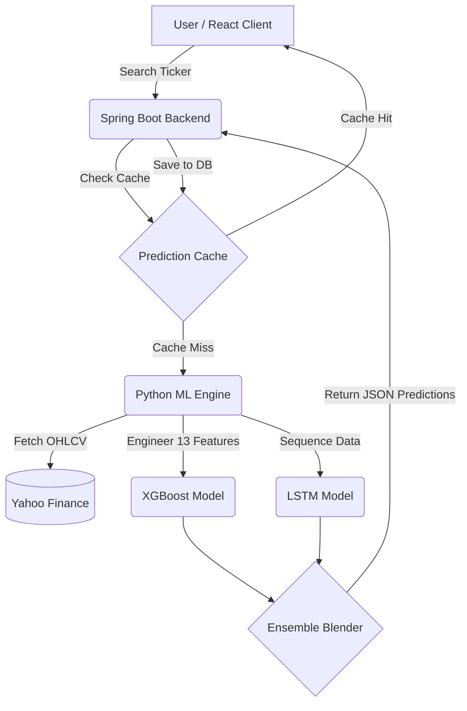

<div align="center">

# 📈 QuantView — StockTrend AI
### *Algorithmic Market Analysis & Predictive Intelligence Platform*

[](https://react.dev)
[](https://spring.io)
[](https://python.org)
[](https://xgboost.ai)
[-EE4C2C?style=for-the-badge&logo=pytorch&logoColor=white)](https://pytorch.org)
[](LICENSE)

*QuantView is a full-stack financial research platform that bridges the gap between retail trading and quantitative analysis. By leveraging a high-performance XGBoost + LSTM ensemble machine learning pipeline, it transforms raw historical data into transparent, actionable predictions.*

[Features](#-features) • [Architecture](#-architecture) • [ML Pipeline](#-the-ml-pipeline) • [Tech Stack](#-tech-stack) • [Getting Started](#-getting-started) • [API Reference](#-api-reference)

</div>

---

> *"Every trade has two participants — one uses intuition, the other uses math. QuantView was built for the second one."*

### ❌ The Problem vs ✅ The QuantView Solution

| Standard Brokerage Platforms | QuantView Intelligence Platform |
| :--- | :--- |
| **Historical Charts** (Focuses on the past) | **Predictive Trend Lines** (Forecasts the future T+1) |
| **"Black Box" Models** (Hidden algorithms) | **"White Box" Analytics** (Visible metrics & feature importances) |
| **Order Execution Focus** | **Data Computation & Trend Analysis Focus** |
| **Zero Model Insight** | **Live Metrics**: MSE, MAE, R² Score, & feature weighting |

---

## ✨ Key Features

- **🔮 Predictive Analytics** — Real-time forecasting using an XGBoost + LSTM ensemble model. Evaluates 13 engineered features to project the **next-day closing price (T+1)** based on 2 years of historical data.
- **📊 Interactive Dashboard** — High-fidelity charts via Recharts overlaying predicted trends onto actual historical prices. KPI cards instantly surface Current Price, T+1 Prediction, R² Score, and MSE.
- **🔬 Algorithmic Transparency** — We believe in a "White Box" approach. QuantView displays live MSE, MAE, R² Score, and feature importance bars so users can evaluate model reliability firsthand.
- **📈 Live Market Data** — Real-time stock quotes via Server-Sent Events (SSE) with intelligent background polling from Yahoo Finance/Finnhub. Top gainers, losers, and volume leaders update continuously.
- **📉 Technical Indicators Built-In** — SMA-20, SMA-50, SMA-200, EMA-20, RSI-14, MACD, and Bollinger Bands are computed instantly on every fetch.
- **🌍 Multi-Market Universe** — Native tracking for 60+ tickers across US equities (NYSE/NASDAQ), Indian markets (NSE/BSE), and major crypto assets (BTC, ETH, SOL, BNB, XRP).
- **⭐ Watchlist & Persistence** — Save frequently tracked stocks with full CRUD operations, backed by H2 (dev) or MySQL (prod) databases.
- **🌗 Premium Theming** — Flawless dark/light mode integration with smooth pill-shaped toggles, CSS theme transitions, and a custom animated cursor.
- **🔐 Secure Authentication** — Fully integrated user management via Clerk (optional — application degrades gracefully and works fully without it).

---

## 🏗️ Architecture

QuantView employs a **three-tier distributed microservice architecture** combining the strengths of three distinct ecosystems:



### ⚡ The Request Lifecycle
1. React client calls `GET /api/predict/AAPL`.
2. Spring Boot checks the Prediction Cache (15-min TTL).
3. On a cache miss, the request forwards to the Python Engine on `:5000`.
4. Python fetches 2 years of OHLCV data and engineers 13 technical features (SMA, RSI, MACD, etc.).
5. **Parallel Training**: Trains XGBoost (200 trees, depth 6) and LSTM (64 units, 150 epochs).
6. **Ensemble Blend**: 60% XGBoost + 40% LSTM.
7. Python returns the prediction, metrics, and feature importances.
8. Spring Boot caches the response and forwards it to React for immediate dashboard rendering.
*(Total time: ~3–8 seconds for a cold request. Instant on cache hit.)*

---

## 🧪 The ML Pipeline

### Why an Ensemble?
Markets are complex. No single model captures everything. By combining **Gradient Boosting** (XGBoost) and **Deep Learning** (LSTM), QuantView captures both immediate feature correlations and long-term sequential dependencies.

| Model | Primary Focus | Practical Example | Speed | Weight |
|---|---|---|---|---|
| **XGBoost** | Feature correlations | *"RSI < 30 indicates oversold"* | ⚡ Fast | 60% |
| **LSTM** | Time sequences | *"3 consecutive red days implies a bounce"* | 🐢 Slower | 40% |

### Feature Engineering (13 Signals)
Raw price data is useless to models. We derive 13 signals automatically:
* **Trend:** `sma_50`, `sma_200`
* **Momentum:** `rsi_14`, `macd`, `macd_signal`
* **Volatility:** `bb_upper`, `bb_lower`
* **Price Action:** `daily_return`, `volume_change`
* **Memory (Lags):** `lag_1`, `lag_2`, `lag_3`, `lag_5`

*Note: Metrics (MSE, MAE, R²) are computed on a 30-day holdout test set to absolutely prevent data leakage.*

---

## 🛠️ Tech Stack

| Domain | Technologies Used |
|---|---|
| **Frontend UI** | React 18, TypeScript, Vite 8, Tailwind CSS 3, shadcn/ui |
| **Data Viz & Motion** | Recharts, Framer Motion, GSAP, Lenis |
| **Backend API** | Java 17, Spring Boot 3.4, Spring Data JPA, SSE Streaming |
| **ML Engine** | Python 3.10+, Flask 3.1, XGBoost 2.1, PyTorch (LSTM), Scikit-learn |
| **Data & Storage** | yfinance, H2 Database (Dev), MySQL 8 (Prod), TanStack Query |

---

## 🚀 Getting Started

### Prerequisites
* Node.js 18+
* Java JDK 17+
* Python 3.10+

> **⚠️ CRITICAL:** Services must be started in this exact order: **Python → Spring Boot → React**

### 1. Python ML Engine (Port 5000)
```bash
cd python-engine
python -m venv venv
source venv/bin/activate        # Linux/Mac (use venv\Scripts\activate on Windows)
pip install -r requirements.txt
python app.py                   
```

### 2. Spring Boot Backend (Port 8080)
```bash
cd backend
chmod +x mvnw                   # First time only
./mvnw spring-boot:run          
```

### 3. React Frontend (Port 5173)
```bash
cd frontend
npm install
npm run dev                     
```

---

## 🗺️ Roadmap

- [x] XGBoost + LSTM ensemble ML pipeline with 13 engineered features
- [x] Spring Boot REST API orchestration with prediction caching (15-min TTL)
- [x] Live market data via SSE streaming + Python background poller
- [x] Watchlist CRUD & Feature importances visualization
- [x] Premium dark/light theming with smooth transitions
- [ ] Temporal Fusion Transformer model upgrade
- [ ] Multi-ticker portfolio optimization
- [ ] Docker Compose single-command deploy orchestration

---

## ❓ FAQ

<details>
<summary><strong>Which markets are supported?</strong></summary>
NYSE, NASDAQ, NSE (India), BSE, and crypto (BTC, ETH, SOL, BNB, XRP). Use suffixes like <code>.NS</code> for NSE stocks (e.g., <code>RELIANCE.NS</code>) and <code>-USD</code> for crypto.
</details>

<details>
<summary><strong>Is the data real-time?</strong></summary>
Yes. A background Python poller fetches live snapshots from Yahoo Finance every 60 seconds and pushes them to Spring Boot via an internal REST endpoint. The frontend receives updates via SSE streams.
</details>

<details>
<summary><strong>Do I need Clerk / API keys to run it?</strong></summary>
No. The app works fully without Clerk — authentication is skipped gracefully. Finnhub and Alpha Vantage keys are also optional; the app falls back to polling / yfinance-only mode perfectly.
</details>

---

## 📄 License
Released under the [MIT License](LICENSE). 

<div align="center">
  <strong>Built with ❤️ by <a href="https://github.com/Kaif89">Kaif</a></strong><br/>
  <em>"In God we trust. All others must bring data."</em> — W. Edwards Deming
</div>
